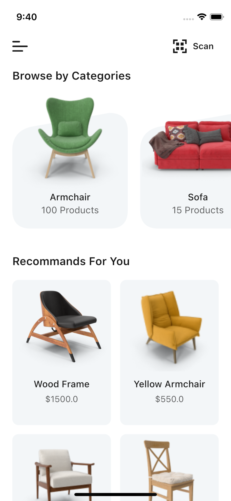
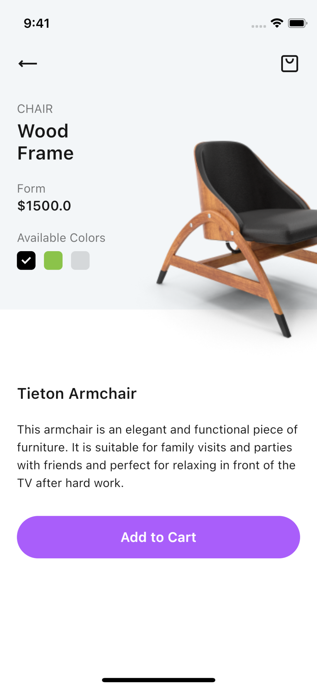
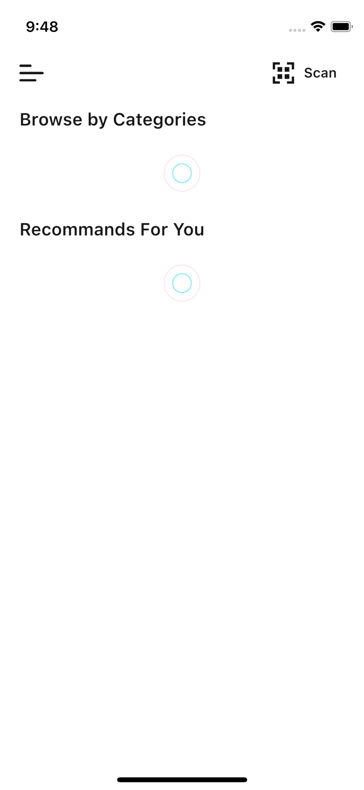
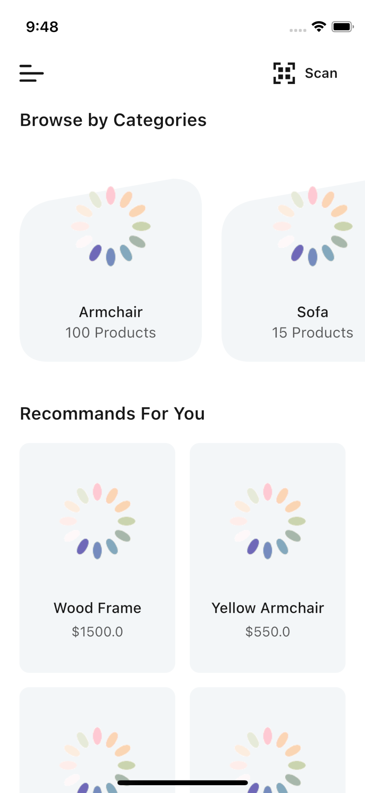

# furniture_api_app

A new Project Flutter for up skill call API, unit test

## Getting Started

A few package using in this project:

- cupertino_icons: ^1.0.2
- flutter_svg: ^1.1.3
- equatable: ^2.0.3
- http: ^0.13.5

A few resources to get you started if this is your first Flutter project:

- [Video Code Tutorial](https://www.youtube.com/watch?v=8uLI8ade1aA)
- [This source code github ](https://github.com/coderThanh/Flutter-Shop-Furniture-Test-Api)

A few file was tested:

- models/category
- models/product
- services/featch_categores
- services/featch_products

A few images demo:

 
 

 
 

 
 

